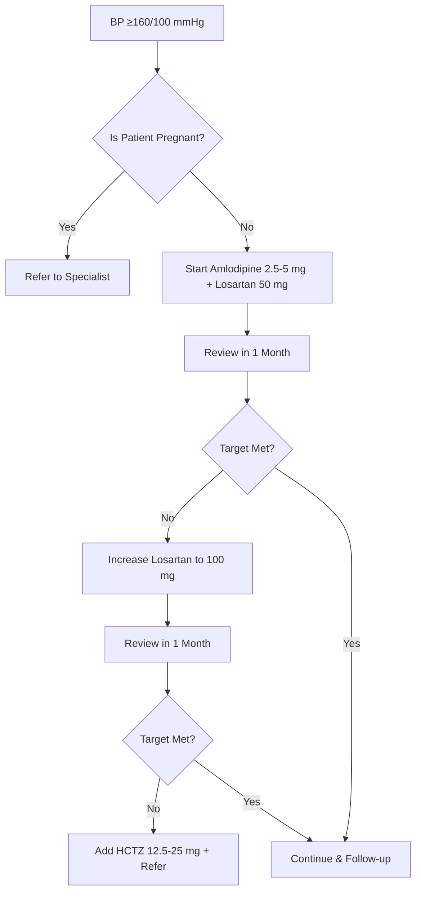

# Hypertension Management Protocol

## Protocol I: Mild to Moderate
**Condition:** SBP 140–159 mmHg and/or DBP 90–99 mmHg

1. Start Amlodipine 2.5–5 mg once daily
2. Review after 1 month
3. If target not met (≤140/90 mmHg for most patients), increase Amlodipine to 10 mg
4. If still not met after 1 month, REFER

## Protocol II: Severe
**Condition:** SBP ≥160 mmHg and/or DBP ≥100 mmHg

